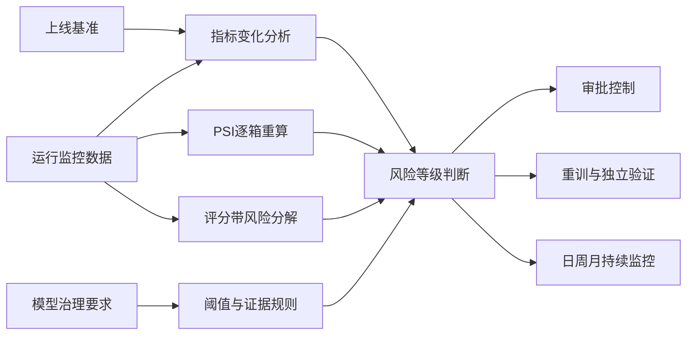

# 消费信贷 AI 模型稳定性评估与治理

> Consumer Credit AI Model Stability Assessment and Governance

这是一个为 AI 设计的金融科技专家评测题，已提交至 AI 数据标注平台，用于通过高难度专业任务、配套附件、参考答案和可判定 Rubrics，帮助 AI 提升金融分析、跨文档推理、模型治理和风险决策能力。

题目基于**虚构机构、虚构模型与合成数据**构建，模拟商业银行对已上线一年的消费信贷 AI 审批模型开展年度稳定性评估。它既是一套完整的 AI 训练与评测材料，也是一项金融科技模型治理案例。

项目覆盖模型性能监控、数据漂移、概念漂移、跨附件证据核验、审批策略调整、模型重训及持续治理，并配套一套可执行的专家评分 Rubrics，用于检验大模型处理复杂金融任务的能力。

## 项目亮点

- 面向 AI 数据标注与能力评测场景设计，目标是帮助 AI 提升专业推理水平。
- 将金融科技业务问题转化为包含 Prompt、附件、参考答案和 Rubrics 的完整评测任务。
- 从原始分箱数据逐箱重算 PSI，而不是直接采用汇总值。
- 识别原始数据与供应商摘要之间的冲突，并按证据优先级作出治理判断。
- 将逾期率变化拆分为评分带结构迁移和评分带内风险变化，区分数据漂移与概念漂移。
- 对照新旧治理阈值，判断模型风险等级和自动审批处置范围。
- 将开放式分析转化为可复核、可二元判定的专家评分标准。
- 同时交付 PDF 报告、Excel 监控数据和 Rubrics 评分表。

## 业务场景

某商业银行的个人消费贷款风险预测模型于 2025 年 1 月上线，用于预测放款后 30 天内发生逾期的概率，并支持自动审批、人工复核和拒绝决策。

运行一年后，模型出现以下现象：

- AUC 与 KS 持续下降；
- 自动审批率下降；
- 成熟样本 30 天逾期率上升；
- 部分输入变量发生显著分布漂移；
- 相同评分带内的逾期率普遍上升；
- 供应商 PSI 摘要与原始分箱重算结果不一致。

本项目需要回答三个关键问题：

1. 模型是否发生数据漂移或概念漂移？
2. 是否应全面暂停模型驱动审批，还是采取局部控制？
3. 应如何重训、验证并持续监控模型？

## 分析框架



### 1. 性能与业务指标

| 指标 | 2025年1月 | 2025年12月 | 变化 |
|---|---:|---:|---:|
| AUC | 0.82 | 0.74 | -0.08 |
| KS | 0.41 | 0.29 | -0.12 |
| 自动审批率 | 42.00% | 31.00% | -11.00个百分点 |
| 成熟样本30天逾期率 | 1.80% | 2.60% | +0.80个百分点 |
| 平均预测PD | 1.75% | 1.95% | +0.20个百分点 |
| 校准缺口 | 0.05个百分点 | 0.65个百分点 | +0.60个百分点 |

### 2. PSI重算结果

本项目采用：

$$
PSI = \sum (A-E)\ln\left(\frac{A}{E}\right)
$$

其中，$A$ 为当前样本占比，$E$ 为基准样本占比。

| 变量 | 重算PSI | 治理分类 |
|---|---:|---|
| income | 0.0889 | 稳定 |
| credit_score | 0.0137 | 稳定 |
| debt_ratio | 0.2655 | 显著漂移 |
| transaction_frequency | 0.3117 | 显著漂移 |

### 3. 逾期率变化分解

按当前评分带结构与基准带内逾期率计算：

- 预期当前逾期数：219.4 笔；
- 预期当前逾期率：2.194%；
- 结构迁移贡献：+0.394 个百分点；
- 评分带内风险变化贡献：+0.406 个百分点。

结构迁移支持数据漂移判断；五个连续评分带的带内逾期率均上升，则构成概念漂移证据。该分解用于模型治理判断，不等同于因果识别。

## 治理结论

综合模型性能、校准、PSI和评分带证据，本期模型达到**红色治理状态**。

建议采取以下措施：

- 不实施无差别全面停用；
- 暂停受影响渠道的直接自动审批并转人工复核；
- 所有关键字段缺失记录不得直接自动审批；
- 对其他渠道临时收紧自动审批条件并设置回退机制；
- 使用最近 12 个月且完成表现观察的样本启动重训；
- 保留时间外验证集，开展冠军—挑战者比较和独立验证；
- 建立日、周、月三级持续监控机制。

## 专家评测设计

Rubrics 将复杂报告任务拆分为以下可核验维度：

- 数据准确性；
- 金融与模型治理专业性；
- 跨文档一致性；
- 观点与决策分析；
- 文档结构与指令遵循；
- 格式规范；
- 幻觉、专业错误及致命交付问题。

评分规则同时包含正向得分、负向扣分和致命项，并为每一项提供证据来源定位，使评估结果可以复核。

## 公开文件

| 文件 | 用途 |
|---|---|
| [附件1：消费信贷AI审批模型上线评估报告](最终提交包/附件1_消费信贷AI审批模型上线评估报告.pdf) | 提供模型背景、上线基准与初始治理阈值 |
| [附件2：消费信贷模型运行监控数据](最终提交包/附件2_消费信贷模型运行监控数据.xlsx) | 提供性能、业务、PSI、评分带及渠道数据 |
| [附件3：银行AI模型治理要求说明](最终提交包/附件3_银行AI模型治理要求说明.pdf) | 定义证据优先级、漂移标准与治理流程 |
| [模型A：消费信贷AI模型稳定性评估报告](最终提交包/modelA_消费信贷AI模型稳定性评估报告.pdf) | AI模型针对本题生成的完整分析报告，用于展示专业推理与报告生成效果 |
| [Rubrics评分表](最终提交包/消费信贷AI模型稳定性评估Rubrics评分表_最终版.xlsx) | 专家级评分规则、分值及来源定位 |

## 推荐阅读顺序

1. 阅读附件1，了解模型上线背景与基准状态；
2. 查看附件2，理解需要计算和核验的原始数据；
3. 阅读附件3，掌握持续治理规则；
4. 阅读模型A生成的完整评估报告，查看AI对题目的分析与决策链路；
5. 使用Rubrics评分表检查报告是否满足专家标准。

## 本项目展示的能力

### 金融科技与模型风险

- 消费信贷审批业务理解
- 信用风险模型性能监控
- 模型校准与阈值治理
- 模型生命周期管理
- 模型风险处置与恢复机制

### 数据分析

- AUC、KS与业务指标趋势分析
- PSI逐箱计算与贡献定位
- 评分带迁移分析
- 风险变化分解
- 数据口径冲突识别

### AI评测

- 专家任务设计
- 多附件推理设计
- 可判定Rubrics设计
- 幻觉与专业错误控制
- 标准答案与评分依据构建

### 专业交付

- PDF与Excel专业报告制作
- 图表、表格与证据定位
- 数据脱敏与合成数据设计
- 文件一致性与版式质量检查

## Repository Structure

```text
.
├─ README.md
└─ 最终提交包/
   ├─ 附件1_消费信贷AI审批模型上线评估报告.pdf
   ├─ 附件2_消费信贷模型运行监控数据.xlsx
   ├─ 附件3_银行AI模型治理要求说明.pdf
   ├─ modelA_消费信贷AI模型稳定性评估报告.pdf
   └─ 消费信贷AI模型稳定性评估Rubrics评分表_最终版.xlsx
```

## Data Statement

本项目中的机构、模型名称、业务数据和监控结果均为虚构或合成内容，不包含真实银行客户信息、个人金融数据或真实商业秘密。项目仅用于展示金融科技分析、AI模型治理和大模型评测设计能力。

## Disclaimer

本项目是专业能力展示案例，不构成真实银行的授信决策、风险政策、监管解释或投资建议。实际生产环境中的模型调整、审批策略变更和重训上线，应经过完整的数据验证、独立模型验证、合规审查和授权审批。
